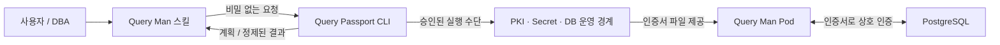

# Query Passport

**쿼리도 여권이 필요합니다.**

Query Passport는 Query Man이 PostgreSQL에 접속할 때 필요한 인증서의 준비·전달·검증·갱신·복구를
지원하는 운영 도구다. Query Man 스킬이 호출하는 CLI를 우선 개발한다. 사람이 직접 실행해도
동일한 입력 검증과 실행 경계를 적용한다.

## 현재 상태와 다음 시작점

현재는 **M1 오프라인 CLI와 M2 로컬 Docker 접속 검증 구현** 상태다. Python 3.12+와 uv로 설치하며 `capabilities`,
`inspect`, `plan`, `verify`를 JSON으로 호출할 수 있다. 로컬 발급 모듈을 위해 `cryptography`를 사용한다.
승인된 로컬 binding을 통한 실제 DB/TLS·인증서 검증을 지원한다. 발급·적용·전달·복구,
Kubernetes, 자동 갱신과 CI는 미구현이다. Query Man 스킬 consumer 연계는 별도 저장소에서 검증했다.
원격 저장소는 [hc-hyun/query-passport](https://github.com/hc-hyun/query-passport)다.
M3의 내부 발급·설정 적용·전달·복구 경로를 새 disposable DB에서 검증했다.
공개 쓰기 CLI와 rotation·기존 DB 전환은 남아 있으며 [로컬 lifecycle](docs/local-lifecycle.md)에 경계를 정리했다.

이 폴더에서 이어서 작업할 때는 [AGENTS.md](AGENTS.md)와
[개발 계획의 첫 작업](docs/development-plan.md#바로-이어서-할-첫-작업)을 읽고 M3부터 시작한다.
기존 호스트 작업물이나 DB를 먼저 옮기거나 수정할 필요는 없다.

## 설치와 실행

최소 검증 환경은 Linux/POSIX, Python 3.12, uv다. Windows 실행은 지원하지 않는다.
저장소 루트에서 다음 명령을 실행한다. 설치에는 package index 접근이 필요할 수 있지만
설치된 CLI의 M1 명령은 네트워크·DB·Docker·인증서·Secret·Query Man 저장소를 읽지 않는다.

```bash
uv sync --locked
uv run --locked query-passport capabilities --format json
uv run --locked query-passport inspect --request examples/request.json --format json
uv run --locked query-passport plan --request examples/request.json --format json
uv run --locked query-passport plan --request - < examples/request.json
uv run --locked query-passport --version
```

live 검사 준비와 결과 해석은 [로컬 Docker executor](docs/local-executor.md)를 따른다.
유효한 operator binding이 없으면 `verify`는 접속 전에 `AUTHORIZATION_REQUIRED`로 거절한다.

독립 CLI 설치는 `uv tool install .`로 가능하다. 이후 `query-passport --help`도 JSON으로 반환한다.
입력 파일 경로는 `--workspace DIR`(기본 현재 디렉터리) 기준 상대 경로다.
예시는 가상 대상이며 실제 alias 등록이나 실행 권한을 의미하지 않는다.

스킬은 먼저 지원 계약 major와 capability를 확인하고, 기존 Query Man 검증이 끝난 profile의
공개 필드만 전달한다. [요청 예시](examples/request.json), [JSON Schema](schemas/request-v1.schema.json),
[상세 계약](docs/tool-contract.md)을 함께 참고한다. `profile_version`은 기존 profile v1을 가리키는
요청 envelope의 필드이며 Query Man profile 자체를 수정하는 필드가 아니다.

`inspect`의 `validated`는 공개 입력 검사 완료, `plan`의 `planned`는 오프라인 계획 생성만 뜻한다.
계획은 항상 `executable: false`이며 DB·인증서·배포·source inventory·application readiness는
`not_checked`다. `source_count: 0`도 정상 입력이다. 이 결과로 앱 활성화나 접속 성공을 보고하면 안 된다.

```bash
uv run --locked pytest -q
uv run --locked ruff check .
uv run --locked ruff format --check .
uv run --locked mypy
uv build
```

| 문서 | 책임 |
|---|---|
| [개발 계획](docs/development-plan.md) | 단계별 구현 범위, 산출물, 완료 기준과 남은 결정 |
| [Tool contract](docs/tool-contract.md) | Query Man 스킬이 도구를 호출하는 입력·결과·실패 계약 |
| [운영 설계](docs/operations.md) | 신뢰, 자격 증명 전달, 승인, 적용·갱신·복구와 운영 기록 |
| [기존 작업 인계](docs/local-handoff.md) | 로컬 voc-db 작업물 위치, 현재 상태와 이관 시 주의점 |

## 역할

여권에 비유하면 PKI는 발급기관, 인증서는 여권, private key는 그 소유자임을 증명하는 비밀이다.
Query Passport는 발급 신청부터 전달·유효성 확인·갱신을 처리하는 도구다. 자체 CA 서버를 새로
만드는 것이 첫 목표는 아니다. 운영에서는 승인된 PKI와 Secret 전달 수단을 사용한다.

| 구성 요소 | 담당하는 일 |
|---|---|
| Query Man 앱 | 등록된 source의 metadata와 SQL 조회, reader/allowlist/자원 제한, readiness |
| `query-man-admin` 스킬 | DB profile/source의 저장소 작성·검증, 비밀 없는 입력 수집과 결과 설명 |
| `query-man-dba-onboarding` 스킬 | DBA 실행 계획, 환경·범위 확인, 승인된 운영 도구 호출과 결과 인계 |
| Query Passport | 대상·입력 검증, DB 연결/인증서 검사, 승인된 PKI·DB·배포 작업 실행, 결과 정규화 |
| PKI·Secret 관리 시스템 | 발급 권한과 실제 private key/인증서 보관·전달 |
| DBA·배포 운영자 | 실제 대상의 변경 권한, DB/배포 설정과 복구 책임 |
| 환경 기록 시스템 | 승인과 실제 변경·검증·복구 사실의 보존 |



Query Passport가 중단되어도 이미 준비된 인증서로 수행하는 Query Man의 DB 조회 경로에는 직접
영향을 주지 않는다. 다만 인증서 갱신·재배포·복구 작업에는 이 도구가 필요할 수 있다.
스킬과 도구는 관리 경로에 있고, SQL 요청마다 호출되는 인증 프록시가 아니다.

## 주요 산출물

M1의 package·CLI·공개 입력 계약과 M2의 로컬 Docker 접속 검증·실제 인증 거부 테스트를 구현했다.
아래 표에서 PKI·배포·복구는 후속 개발 대상이다.

| 산출물 | 필요한 결과 |
|---|---|
| 설치 가능한 CLI | 비대화형 실행, JSON 결과, version/capability 탐지, 실패 시 일관된 종료 상태 |
| 요청·계획·결과 계약 | profile·대상·작업 범위·관측 시점·제약을 구분하고 비밀 없는 결과를 스킬에 반환 |
| DB 연결 검사 | 서버 CA/이름·클라이언트 identity·계정·제한·마운트의 실제 검증과 실패 분류 |
| 인증서 준비 흐름 | 로컬 테스트용 발급과 승인된 운영 PKI 연계, 만료·재발급 정보 관리 |
| DB 인증 적용 도구 | 기존 설정을 보존하는 CA trust·HBA·DN mapping 계획/적용/검증/복구 |
| Credential 전달 도구 | host 또는 Pod에 profile별 세 파일을 안전하게 제공하고 권한을 검증 |
| 갱신·복구 흐름 | 새 인증서 검증 후 전환, 이전 신뢰 정리, 일부 실패·중단에서 재개 또는 복구 |
| Query Man 스킬 연계 | 지원 version 확인, 도구 실행, 결과의 현재/미완료 상태를 구분하는 호출 경로 |
| 테스트·운영 문서 | 비밀 비노출, target drift, 인증 거부·취소·롤백·갱신 테스트와 실행 방법 |

## 범위

첫 대상은 **직접 연결하는 PostgreSQL 18/UTF8와 로컬 disposable Docker 검증 환경**이다.
DB profile만 있고 source가 없는 상태를 지원한다. 인증서는 Query Man 배포 × DB profile 단위로
준비하며, 접속 파일은 기존 `ca.crt`, `client.crt`, `client.key` 계약을 유지한다.

기존 source의 reader와 허용 DN mapping을 입력받아 인증을 검사할 수 있지만, 업무 의미·view·reader
권한을 새로 설계하는 권한은 Query Passport에 없다. 확인용 계정의 연결 성공은 source 전체
admission이나 Query Man 서비스 활성화 완료와 다르다.

Kubernetes 전달과 갱신은 후속 단계로 개발한다. PgBouncer, replica/failover, 여러 PKI provider,
MCP server와 UI는 실제 환경 요구와 검증 기준을 확인한 뒤 범위를 정한다. 기존 PostgreSQL이나
Kubernetes가 내부적으로 제공하는 TLS/Secret 기능을 다시 구현하지 않는다.

## 기존 Query Man과의 관계

현재 로컬 앱 저장소는 `../query-boy`이며 제품명은 Query Man이다. Admin은 bounded helper로
오프라인 `inspect`·`plan`, DBA는 기존 Execute 범위에서 `verify`를 호출한다.
consumer 연계 커밋은 `8d7e93b`이며 실제 disposable DB 호출까지 검증했다.
앱 runtime의 profile·source·DB 인증 계약과 기존 자격 증명은 변경하지 않았다.

보존해야 할 기존 계약은 다음 문서에 있다. 이 작업 폴더가 이동하면 상대 경로 대신 실제 Query Man
checkout을 지정하고 해당 revision을 확인한다.

- [DB profile과 인증서 결정](../query-boy/docs/decisions/0036-database-profile-client-certificate.md)
- [인증서·마운트·갱신 절차](../query-boy/docs/database-certificate-authentication.md)
- [Admin 스킬](../query-boy/.agents/skills/query-man-admin/SKILL.md)
- [DBA onboarding 스킬](../query-boy/.agents/skills/query-man-dba-onboarding/SKILL.md)

DB 접속 기능이 준비되어도 source와 HTTP 인증이 없으면 앱을 시작할 수 없다. 그 경계를 바꾸지 않고
운영에 필요한 도구를 제공하는 것이 이 프로젝트의 목적이다.
